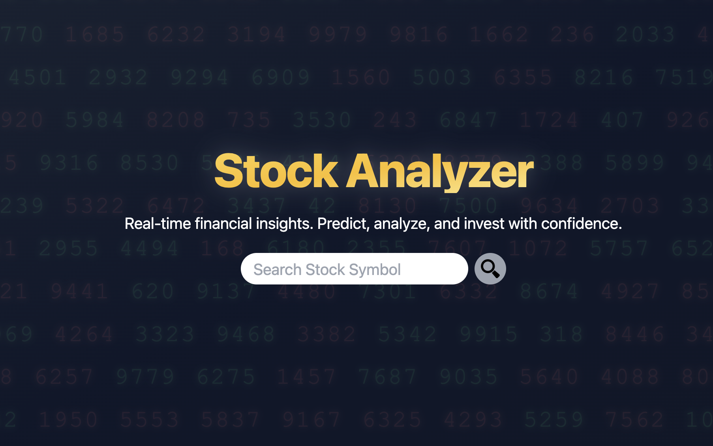

# Stock Analyzer

[Stock Analyzer](https://stock-analyzer-iota.vercel.app/) is a web application built with [Next.js](https://nextjs.org/) that provides real-time financial insights, allowing users to analyze stock performance, predict trends, and make informed investment decisions.

<div style="text-align: center;">
  
</div>


## Features

- **Stock Symbol Search**: Quickly search for stock symbols and retrieve detailed financial data.
- **Financial Analysis**: Run simplified version of DCF and multiples valuation to analyze
the stock price.
- **Dynamic Visualizations**: View key metrics like profit margins, free cash flow, and P/E ratios.
- **Real-Time Data**: Fetch live stock price information and financial data from APIs.
- **Interactive UI**: Smooth animations and responsive design for an engaging user experience.

## Technologies Used

- **Frontend**: [Next.js](https://nextjs.org/), [React](https://reactjs.org/), [Tailwind CSS](https://tailwindcss.com/)
- **APIs**:
  - [Alpha Vantage](https://www.alphavantage.co/) for financial data.
  - [Finnhub](https://finnhub.io/) for real-time stock prices.
- **Animations**: [Framer Motion](https://www.framer.com/motion/) for smooth transitions and effects.

## Getting Started

Follow these steps to set up and run the project locally:

### Prerequisites

- Node.js (v14 or later)
- npm or yarn

### Installation

1. Clone the repository:
   ```bash
   git clone https://github.com/your-username/stock-analyzer.git
   cd stock-analyzer
2. Install dependencies:
    ```bash
    npm install
    # or
    yarn install
3. Create a .env.local file in the root directory and add your API Keys:
    ```bash
    ALPHA_API_KEY=your_alpha_vantage_api_key
    FINNHUB_TOKEN=your_finnhub_api_key