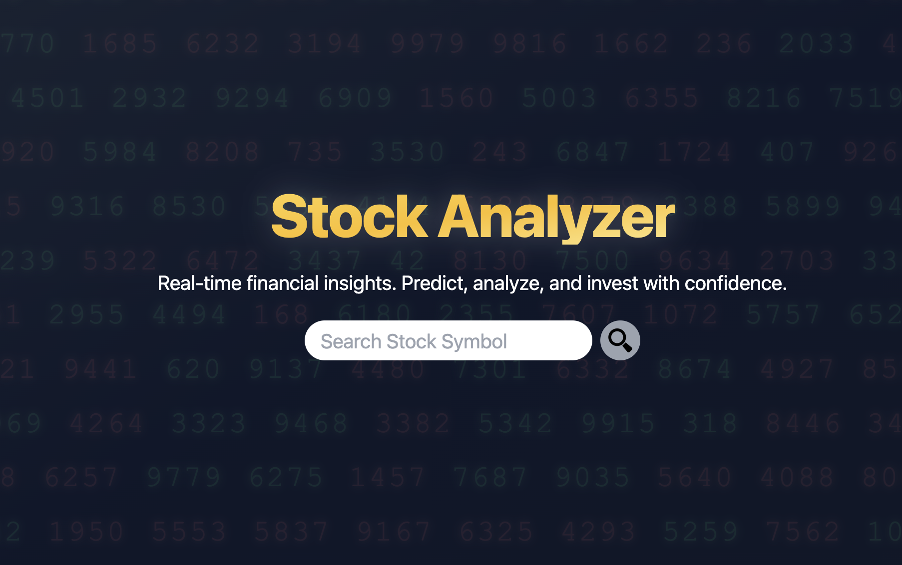

# Stock Analyzer

[Stock Analyzer](https://stock-analyzer-iota.vercel.app/) is a web application built with [Next.js](https://nextjs.org/) that provides real-time financial insights, allowing users to analyze stock performance, predict trends, and make informed investment decisions.

<div style="text-align: center;">
  
</div>


## Features

- **Stock Symbol Search**: Quickly search for stock symbols and retrieve detailed financial data.
- **Financial Analysis**: Run simplified version of DCF and multiples valuation to analyze
the stock price.
- **Dynamic Visualizations**: View key metrics like profit margins, free cash flow, and P/E ratios.
- **Real-Time Data**: Fetch live stock price information and financial data from APIs.
- **Interactive UI**: Smooth animations and responsive design for an engaging user experience.

## Technologies Used

- **Frontend**: [Next.js](https://nextjs.org/), [React](https://reactjs.org/), [Tailwind CSS](https://tailwindcss.com/)
- **APIs**:
  - [SEC EDGAR](https://www.sec.gov/search-filings/edgar-application-programming-interfaces) for free financial statements and company metadata.
  - [Finnhub](https://finnhub.io/) free tier for stock quotes and a current share-count fallback (optional).
  - Yahoo Finance for the existing market-index banner.
- **Animations**: [Framer Motion](https://www.framer.com/motion/) for smooth transitions and effects.

## Getting Started

Follow these steps to set up and run the project locally:

### Prerequisites

- Node.js 22 or later
- npm or yarn

### Installation

1. Install dependencies:
   ```bash
   npm install
   ```
2. Copy `.env.example` to `.env.local` and set:
   ```dotenv
   SEC_USER_AGENT="StockAnalyzer your-real-contact-email@example.com"
   FINNHUB_TOKEN=your_free_finnhub_api_key
   ```
   SEC EDGAR needs no API key or paid subscription. Its [fair-access policy](https://www.sec.gov/search-filings/edgar-search-assistance/accessing-edgar-data) requires an identifying User-Agent; use an app name and real contact email. Requests run on the server, so this value is not exposed to the browser. `FINNHUB_TOKEN` is optional: without it, statements remain available, but live prices and price-based ratios are unavailable. Scenario analysis also requires a share count, which some companies only provide through the Finnhub fallback. Alpha Vantage credentials are no longer used.
3. Start the app:
   ```bash
   npm run dev
   ```

For a hosted deployment, set `SEC_USER_AGENT` and, optionally, `FINNHUB_TOKEN` in the hosting environment as well. `.env.local` is git-ignored and is not deployed.

## Financial data coverage

- Supports SEC-reporting companies with quarterly US-GAAP facts in USD, including up to 40 quarters of history. Five-year revenue growth requires 24 consecutive quarters.
- Converts cumulative year-to-date figures into standalone quarters using actual fiscal dates, including Q4 as the annual total less the Q3 year-to-date total. This supports retail calendars such as Costco's 12/12/12/16-week year and 17-week Q4 in a 53-week year. Cumulative values are subtracted only within the same concept and fiscal year. Directly reported quarters take precedence; duplicate facts use the latest filing, and derived values do not subtract a later restatement from an older total.
- Earnings use `NetIncomeLoss`. When absent (for example, recent TXRH filings), parent earnings are derived from `ProfitLoss` less `NetIncomeLossAttributableToNoncontrollingInterest`, matched by period and filing before quarter conversion. Missing noncontrolling interests are never assumed to be zero.
- Free cash flow is operating cash flow less cash capital expenditures. Capital expenditure tags cover property/plant/equipment, with productive assets (including software and intangibles) as a fallback. This may differ from a company's adjusted FCF definition.
- Company Facts omits custom and segment-level tags. Funds, IFRS/non-USD filers, and companies without supported revenue tags show a coverage message. Missing fields and incomplete/gapped history display `-`, rather than zero or an invented annual figure.
- Share counts use reported common shares, with the SEC's entity common-share fact as a fallback. Counts are matched at or before quarter end within 100 days; weighted-average diluted shares are not substituted. When SEC omits the total (for example, DUOL and META), Finnhub's free [Company Profile 2](https://finnhub.io/docs/api/company-profile2) supplies current shares outstanding, converted from millions. This count is identified in the UI and kept separate from historical SEC quarters. Unusual share classes and depositary receipts may require additional normalization and should be checked against the filing.
- P/E and P/FCF use the current quote times available shares outstanding, divided by the latest four quarters of earnings or free cash flow. They require all three inputs; a working quote alone is insufficient. The 3- and 5-year ratio columns remain `-` because historical market prices are not loaded.
- SEC EDGAR does not provide live prices. Quotes still come from Finnhub. The market-index banner retains its separate Yahoo Finance integration.

## Caching and rate limits

- Next.js Data Cache stores the ticker directory and fallback share counts with a 24-hour revalidation interval and normalized financial statements with a 6-hour interval. The share-count endpoint is requested only when SEC shares are missing. This avoids repeatedly downloading multi-megabyte Company Facts files. After expiry, Next may serve the previous value during background revalidation.
- Concurrent identical loads are coalesced per process. Quotes use a bounded in-memory cache for 60 seconds; they refresh independently of statements.
- SEC requests start at most four times per second per process; Finnhub requests are paced below 60 per minute per process. Requests have 15-second timeouts and HTTP 429 responses trigger a cooldown. Transient failures are not saved as successful financial data.
- The SEC limit applies across all instances using the service. Before scaling to multiple busy server instances, use a shared limiter or a single ingestion worker. The local limiter alone does not enforce an aggregate deployment-wide limit. Next Data Cache persistence depends on your host; Vercel provides shared persistence, while self-hosted deployments need a shared cache handler for multiple instances.

## Validation

```bash
npm test
npm run build
```

The tests exercise cumulative-to-quarter conversions, filing revisions, real SEC facts for AAPL/DUOL/META/TXRH/CRM/COST, retail fiscal calendars, missing data, six-year growth windows, quote and profile failures, cache expiration, and rate-limit recovery. Fixtures contain small subsets of public SEC/Finnhub data and record their source URLs.
